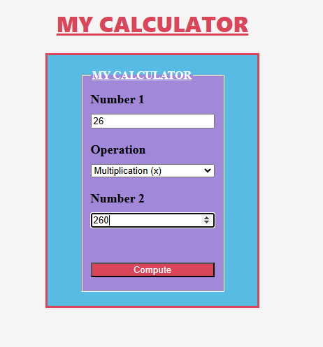
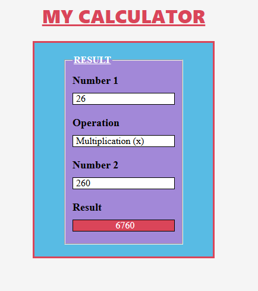

# Introduction
Hi guys! 
I’m back with another mini project. This time, I played around with Node.js and some of its key packages, including <b>Express</b> and <b>Nodemon </b>.

To keep things simple, I built a calculator app. You just pick two numbers and choose an operation (add, subtract, multiply, or divide). When you click "compute", the app sends your request
to the server, which does the math for you and sends the answer (response) back to be shown on your screen (aka your browser also called client).

It’s a simple project, but it’s a great way to see how a website and a server work together behind the scenes.

# Client - Server, what is that?

Client–server interactions might sound complicated, but don’t worry, here’s a simple way to understand it!

<b>The client (the browser) is the one asking the question. </b>
The user types two numbers and an operation into the calculator. For example:
26 × 260.
The browser then politely asks:
“Hey server, can you calculate 26 × 260 for me?”

<b>The server is the brain of the operation. </b>
It receives the request, does the math, and replies:
“Got it! The result of 26 × 260 is 6 760.”

Back to the browser 🎉
Once the server sends the answer back, <b>the browser simply displays the result on the screen so the user can see it. </b>

In short:
<b>👉 Browser asks → Server thinks → Browser shows the answer.</b>

 
# Project Goal
Building a calculator might just be an excuse... but a fun one.
The learning goal of this project is to:
- Understand how Node.js works
- Learn how to create a server with Express
- See how client requests and server responses work
- Use Nodemon to improve development workflow
- Level up your HTML & CSS skills (Ciara in the building)

# Technologies Used

### Node.js
<b>Node.js</b> is a JavaScript runtime that lets JavaScript run outside the browser. Originally, JavaScript was designed to work only in the browser, but modern applications often need it in other parts, like the backend.

That’s where Node.js comes in. It provides all the tools and environment needed to run JavaScript on a server, allowing you to build web servers, handle requests, work with databases, and much more, all without a browser.

### Express
<b>Express</b> is a framework built on top of Node.js that makes building servers easier.
It helps you control where requests go and how responses are sent.

In this project, Express is used to define routes (URLs), receive user input from the calculator, send the calculated result back to the browser.

### Nodemon
<b>Nodemon</b> is a development tool that saves time.

Imagine Nodemon as a helpful assistant who watches your code. Every time you change something, it automatically restarts the server for you.

This means you don’t have to stop and restart the server manually after each change.

### HTML & CSS
These two don't need an introduction.

# Installation
To run this project locally, start by cloning this repository. Make sure you have [Node Js](https://nodejs.org/en/download) installed on your computer.

Then install the necessary packages: `npm i`

And run the code with: `npm run dev`

Voilà! You can play with your new calculator.
